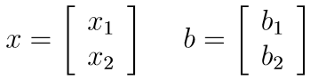
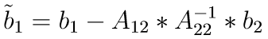
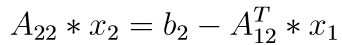

# Schur complement
Let us seprarate the rows and columns of a symmetric matrix A into 2 groups and define the block submatrices: 

If A22 is invertible, the Schur complement of the block A22 is defined as:

The Schur complement is important in many applications, such as domain decomposition methods, homogenization, etc, and has some interesting properties: e.g. if A is symmetric positive definite, then so is the Schur complement of A22 and vice-versa. For more details see this [wikipedia article](https://en.wikipedia.org/wiki/Schur_complement).

# Static condensation
Let us apply the previous decomposition to a linear system `A*x = b`:

 

Suppose we need to work only with the group 1 of rows/columns, without completely disregarding the contribution of group 2. In this case we typically condense the submatrix A22 using its Schur complement. We also condense the subvector b2:

Then we can solve the system with respect to x1 only:

If x2 is needed, it can be calculated afterwards by solving the linear system:

