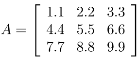
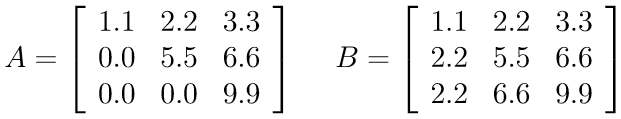

# Intro
If a matrix (or vector) contains many zero entries, it is called sparse. Otherwise it is called dense. The storage format of a sparse matrix (or vector) is important. While we could store all its entries, this is often inefficient since it requires a lot of memory and computational time to process its unnecassary entries, when performing linear algebra operations. Instead we could store only the nonzero ones and process only those if the zero entries do not affect the result. The following matrix and vector formats are supported in **MSolve.LinearAlgebra**.

# Full vector format
All entries of the vector are stored in an array.

# Sparse vector format
Only the non zero entries of the vector are stored in an array. A second array is needed to store the indices of the non-zero entries. Indices start from 0 in ~~C#~~ all proper programming languages. E.g. the vector 

 

will be stored as
```csharp
double[] valuesV = { 1.1, 2.2, 3.3, 4.4 };
int[] indicesV = { 0, 1, 3, 6 };
```

# Full matrix format
All entries of the matrix are stored in a one-dimensional array according to a column major layout: entries of the same column are stored contiguously, while entries of the same row are not. E.g. the matrix  

 

will be stored as 
```csharp
double[] valuesA = { 1.1, 4.4, 7.7, 2.2, 5.5, 8.8, 3.3, 6.6, 9.9 };
```

For more details see [Full Storage](https://software.intel.com/en-us/mkl-developer-reference-c-matrix-storage-schemes-for-lapack-routines#FULL_STORAGE).

# Packed matrix format
Only the entries of the upper or lower triangle of a matrix are stored, including the diagonal. This format is suitable for dense lower/upper triangular matrices and symmetric matrices. E.g. the matrices

 

can be stored as
```csharp
double[] valuesA = valuesB = { 1.1, 2.2, 5.5, 3.3, 6.6, 9.9 };
```
For more details see [Packed Storage](https://software.intel.com/en-us/mkl-developer-reference-c-matrix-storage-schemes-for-lapack-routines#PACKED_STORAGE).

# Compressed Sparse Rows/Columns formats
Only the non-zero entries of a sparse matrix are stored, no matter how they are distributed. Two more arrays are needed to store the row and column indices of the non-zero entries. These formats are very efficient for matrix-vector and matrix-matrix multiplications, but not for creating the matrix itself. For example the matrix:

 

will be stored in the Compressed Sparse Rows (CSR) format as
```csharp
double[] valuesA = { 9, 3, 8, 2, 6, 1, 5 };
int[] colIndicesA = { 0, 2, 1, 1, 2, 0, 3 };
int[] rowOffsetsA = { 0, 2, 3, 5, 7 };
```
where the `rowOffsetsA` array contains the index into `valuesA` where each row of the matrix starts. Its last entry is the number of non-zero entries of the matrix. The same matrix will be stored in the Compressed Sparse Columns (CSC) format as
```csharp
double[] valuesA = { 9, 1, 8, 2, 3, 6, 5 };
int[] rowIndicesA = { 0, 3, 1, 2, 0 };
int[] colOffsetsA = { 0, 2, 4, 6, 7 };
```

For more details see [this Wikipedia article](https://en.wikipedia.org/wiki/Sparse_matrix#Compressed_sparse_row_(CSR,_CRS_or_Yale_format)).

# Dictionary Of Keys format
Dictionary Of Keys (DOK) is a format that allows efficient creation of a matrix, by using dynamic data structures. However these structures are not optimal to implement most linear algebra operations. Therefore the matrix is usually constructed in DOK format and then transformed to other formats that allow efficient implementations of the operations needed (e.g. CSR/CSC for multiplications. 

# Skyline matrix format
The Skyline format (SKY) for symmetric matrices stores the part of each column from its diagonal entry up to the highest non-zero entry. This means that some zero entries will be explicitly stored. Skyline is optimal for applications where the matrix will be factorized (e.g. Cholesky factorization), since the extra zero entries will be filled by the factorization algorithm either way. Skyline is also convenient to construct matrices. For example the matrix:

 

will be stored as
```csharp
double[] valuesA = { 1, 2, 3, 4, 5, 6, 7, 0, 8, 9, 10, 11, 0, 0, 12, 13, 14, 15, 16, 0, 17 };
int[] diagOffsetsA = { 0, 1, 3, 5, 9, 11, 15, 17, 20 };
```
where the `diagOffsetsA` array contains the index into `valuesA` of each diagonal entry. Its last entry is the number of non-zero entries of the matrix. 
