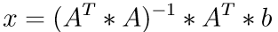
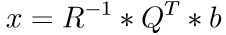
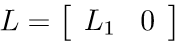

# QR factorization
For any matrix `A (m x n), m >= n` we can calculate its QR factorization `A= Q*R`, where `Q (m x m)` is an orthogonal matrix and `R (m x n)` is defined as

where `R1 (n x n)` is an upper triangular matrix. For more details see [this Wikipedia article](https://en.wikipedia.org/wiki/QR_decomposition).

# Solving least squares problems
Assume an overdetermined linear system `A*x = b` with `A (m x n), m >= n` and `rank(A) = n`. This linear system does not have a solution, but we can find a vector x that minimizes `||b-A*x||`, which is equal to the sum of squares of entries of `b - A*x`. This is called a least squares problem. The solution of the least squares problem is

By applying the QR factorization, the above equation leads to

where the multiplication with R-1 is implemented as a forward substitution with the upper triangular matrix R1. For more details see [this video](https://www.youtube.com/watch?v=OCLFZwi40nM).

# LQ factorization
For any matrix `A (m x n), m <= n` we can calculate its LQ factorization `A= L*Q`, where `Q (n x n)` is an orthogonal matrix and `L (m x n)` is defined as

where `L1 (m x m)` is a lower triangular matrix. For more details see [this](https://software.intel.com/en-us/mkl-developer-reference-c-orthogonal-factorizations-lapack-computational-routines#QRFACTOR).

# Solving minimum norm problems
Assume an underdetermined linear system `A*x = b` with `A (m x n), m < n` and `rank(A) = m`. This linear system has an infinite number of solutions. In this case it is often useful to find the unique solution that minimizes ||x||2. This is called a minimum norm problem. The solution of the min norm problem is

By applying the LQ factorization, the above equation leads to

where the multiplication with L-1 is implemented as a back substitution with the lower triangular matrix L1. For more details see [this](https://see.stanford.edu/materials/lsoeldsee263/08-min-norm.pdf).